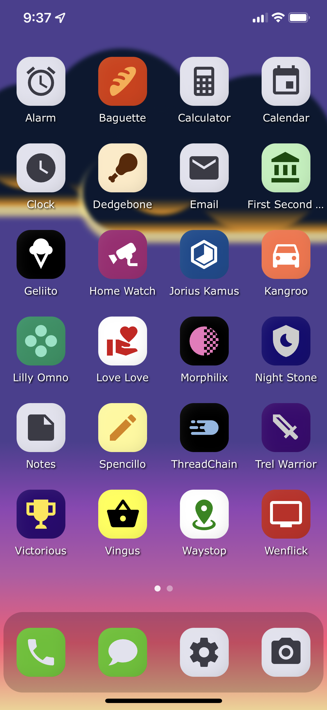

# Stock App Home Screen

A "home screen" full of fake apps to use for stock photos.

<div align="center">
  
</div>

# Usage

As much as legally possible, I'm placing this in the public domain. You are allowed to do anything you want with this code, subject to the terms of the libraries its built with and any trademarks or copyrights thereof.

1. On an iPhone in Safari, go here: https://hperrin.github.io/stock-app-home-screen/
2. Click the Share button.
3. Click "Add to Home Screen".
4. Put in a name and add the shortcut to your home screen.
5. Launch it from the new shortcut on your home screen to get the fullscreen view.
6. You're ready to take stock photos with your phone.

# Running the App

```
npm run dev -- --host
```

Then visit the app on your iPhone, click share, add it to your home screen, then open it from there. You can now take stock photos of your phone without any trademarked app names or icons.
